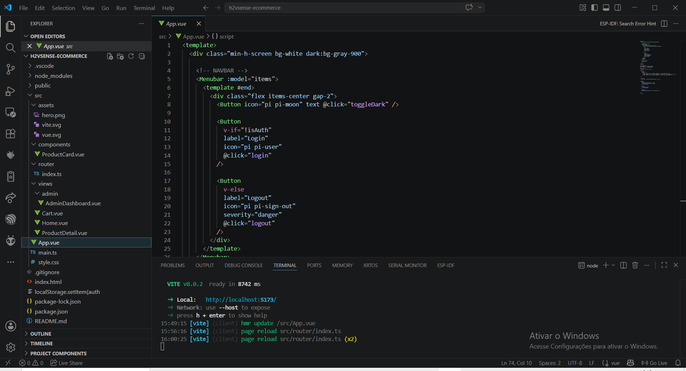
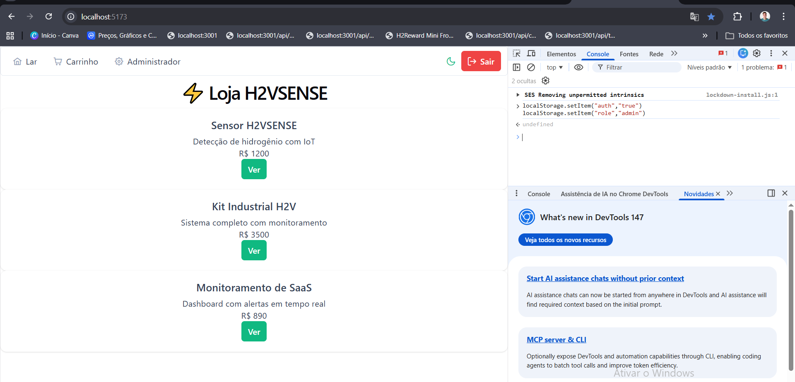

# ⚡ H2VSENSE E-commerce

Plataforma web desenvolvida para o Hackathon utilizando:

- Vue 3
- TypeScript
- PrimeVue
- Tailwind CSS
- Vue Router
- Vite

O projeto simula um e-commerce inteligente da startup **H2VSENSE**, focada em soluções de monitoramento de hidrogênio verde com IoT.

---

# 🚀 Demonstração

## 🖥️ Interface do Projeto

📌 Visão geral do código e estrutura do sistema:



---

## 🎬 Interface da Aplicação

📌 Tela principal da loja (H2VSense E-commerce):



---

# 🧠 Funcionalidades

## 👤 Área do Consumidor

✔ Home com vitrine de produtos  
✔ Página de detalhes do produto  
✔ Carrinho dinâmico  
✔ Adicionar/remover produtos  
✔ Atualização automática do total  
✔ Dark Mode  
✔ Navegação SPA com Vue Router  

---

## 🔐 Segurança e Guards

✔ Guard de autenticação  
✔ Proteção da rota Checkout  
✔ Proteção da rota Admin  
✔ Login fake usando localStorage  

---

## 🧑‍💼 Área Administrativa

✔ Dashboard Admin  
✔ DataTable PrimeVue  
✔ Layout separado da área do consumidor  
✔ Estrutura preparada para CRUD  

---

# 🛠️ Tecnologias Utilizadas

| Tecnologia | Função |
|---|---|
| Vue 3 | Framework frontend |
| TypeScript | Tipagem |
| PrimeVue | Componentes UI |
| Tailwind CSS | Estilização |
| Vue Router | Rotas SPA |
| Vite | Build Tool |

---

# 📂 Estrutura do Projeto

```bash
h2vsense-ecommerce
│
├── docs
│   ├── h2vsense-codigo.png
│   └── h2vsense-store.gif
│
├── public
│
├── src
│   ├── assets
│   │
│   ├── components
│   │   └── ProductCard.vue
│   │
│   ├── router
│   │   └── index.ts
│   │
│   ├── views
│   │   ├── Home.vue
│   │   ├── ProductDetail.vue
│   │   ├── Cart.vue
│   │   │
│   │   └── admin
│   │       └── AdminDashboard.vue
│   │
│   ├── App.vue
│   ├── main.ts
│   └── style.css
│
├── index.html
├── package.json
├── vite.config.ts
├── tailwind.config.js
├── .gitignore
└── README.md
```

---

# ⚙️ Como Executar o Projeto

## 1️⃣ Clonar o Repositório

```bash
git clone https://github.com/EDNARDOPPEIXOTO99/h2vsense-ecommerce.git
```

---

## 2️⃣ Entrar na Pasta

```bash
cd h2vsense-ecommerce
```

---

## 3️⃣ Instalar Dependências

```bash
npm install
```

---

## 4️⃣ Rodar o Projeto

```bash
npm run dev
```

---

## 5️⃣ Abrir no Navegador

```bash
http://localhost:5173
```

---

# 🔐 Testando Login Fake

Abra o Console do Navegador (F12):

```js
localStorage.setItem("auth","true")
localStorage.setItem("role","admin")
```

Agora as rotas protegidas estarão liberadas:

- `/cart`
- `/admin`

---

# 🔥 Funcionalidades do Vue Router

✔ Rotas dinâmicas  
✔ Navegação SPA  
✔ Guards de autenticação  
✔ Guards de Admin  
✔ Estrutura escalável  

---

# 🎯 Critérios da Atividade Atendidos

## ✅ Configuração do Router
✔ Home  
✔ Product Detail  
✔ Carrinho  

---

## ✅ Layouts Diferenciados
✔ Área Consumidor  
✔ Área Admin  

---

## ✅ Guards
✔ Checkout protegido  
✔ Admin protegido  

---

## ✅ Desafio
✔ DataTable  
✔ Menubar  
✔ Nested Structure  
✔ Breadcrumb preparado  

---

# 🌎 Deploy

Projeto preparado para deploy na:

- Vercel
- Netlify

---

# 👨‍💻 Autor

## Ednardo Pinheiro Peixoto

GitHub:

https://github.com/EDNARDOPPEIXOTO99

---

# ⚡ H2VSENSE

Monitoramento inteligente de hidrogênio verde com IoT.